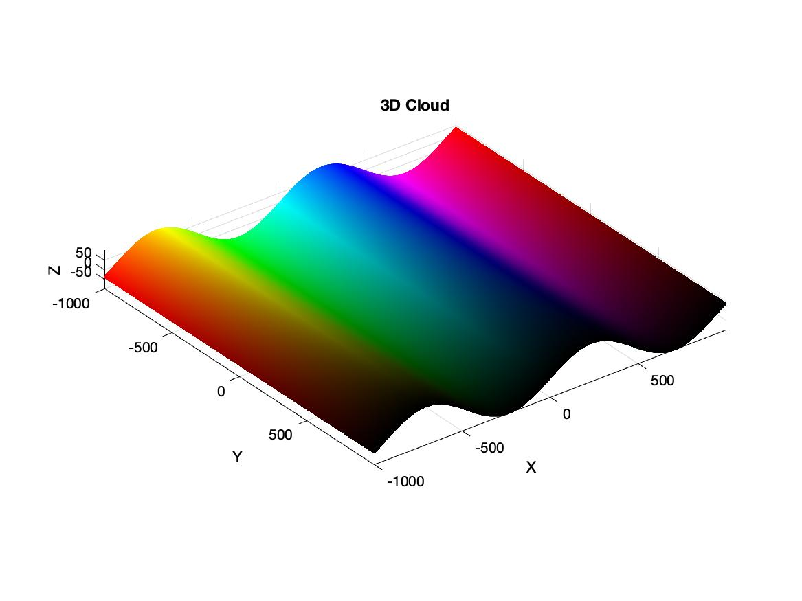
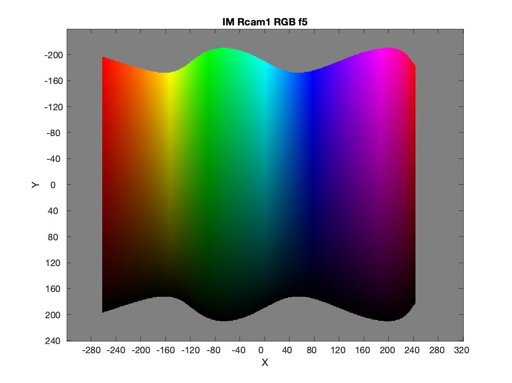
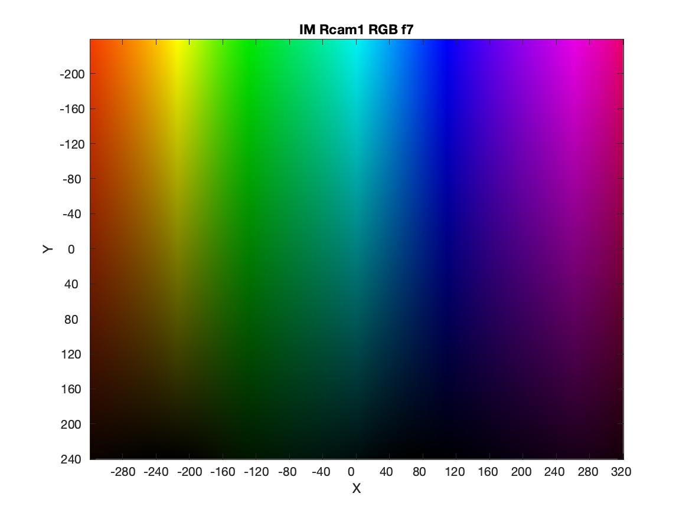
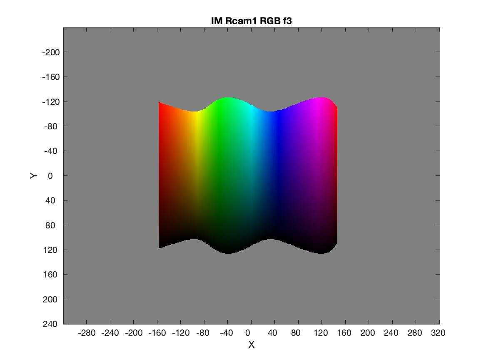
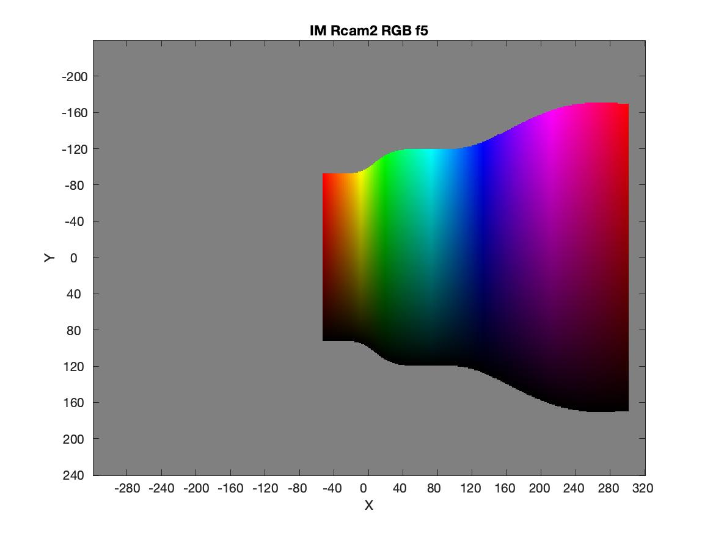
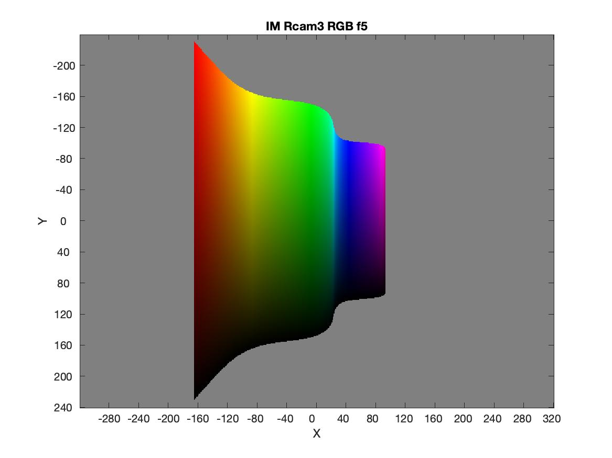

# Virtual_Camera
Use Matlab to create a virtual camera
I use the 3D Scene like this:

I use a virtual camera to take a picture of the 3D scene.
the camera is with f: 5 at the bottom of the 3D scene.

In the code you can change the length of f to mock like a real camera:
like f7:

like f3:

change the position of the camera:
like

How to run the code:
it can run automatically!
you can also change the main part to change the paramaters
like length, position
